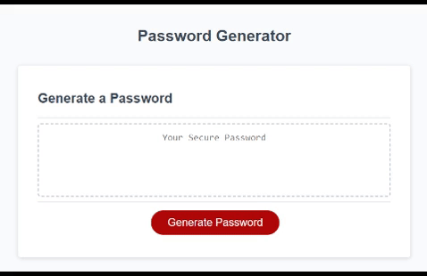

# PasswordGenerator


## Introduction
This password generator takes user input on how long they would like their password to be.
As long as the user's input falls within the allowed bounds of 8-128 characters, the user will then
be prompted to choose from various character types to include. These character types include
special characters, numbers, lowercase and uppercase english letters. 
Through creating this password generator, I learned how to handle various JavaScript methods and elements,
such as event handlers, query selectors, and prompt boxes. 

## Build Process
- Read the user story and acceptance criteria
- Break the task down into smaller topics of how to handle the button and event handlers, how to handle prompt boxes, and how to perform the logic required to generate a random password
- Write pseudocode for the various tasks
- Created variable names and possible values / datatypes
- Created the logic required for randomly selecting a character within specified parameters
- Created alert boxes, prompt box, and confirm boxes
- Put all the various functions together to create generatePassword() and writePassword()
- Refactor and condense functions and unneeded variables

## Code Snippet
The 2 functions are used to randomly generate indexes based on the length of the parameter array's length and it's nested array's lengths. Using these, a truly random character can be chosen every time the function is called. This is important to create a random password.
```
// generates a random index between 0 and the number of chosen parameters and returns it
function parameterSelector() {
  parameterIndex = Math.floor(Math.random()*(chosenParameters.length)); 
  return parameterIndex;
}

// generates a random character from the selected parameter array and returns it
function characterSelector(i) {
  var secondaryIndex = Math.floor(Math.random()*chosenParameters[parameterIndex].length)
  var chosenCharacter = chosenParameters[parameterIndex][secondaryIndex];
  return chosenCharacter;
}
```

## Usage 
[Deployment](https://peterkim89.github.io/PasswordGenerator/) <br>
<br>
Upon clicking the generate button, the user will be prompted to enter their desired password length.
If the input is an appropriate length, the user will then be prompted to choose whether or not they want to include special characters, numbers, lowercase and uppercase english letters. If the password length is not an appropriate value, an alert will appear and exit out to the DOM. If the password length is appropriate though, a randomly generated password will appear within the box.

## Languages
- JavaScript
- HTML
- CSS

## Author
[GitHub](https://github.com/PeterKim89) <br>
[LinkedIn](www.linkedin.com/in/peter-kim89)   
[Email]Peter.Kim@uconn.edu

## License
[MIT](https://choosealicense.com/licenses/mit/) <br>
Copyright (c) [2022] [Peter Kim]
